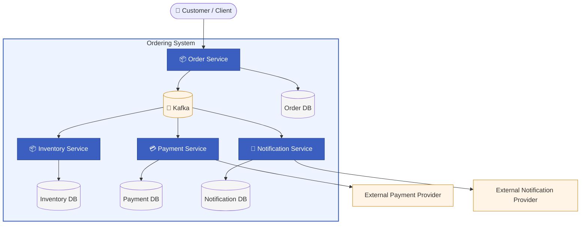

# Microservices Order System

> A production-oriented reference architecture demonstrating reliable event-driven communication, distributed workflow orchestration, cloud-native deployment and evolutionary architecture.

This repository is not intended to showcase how to build microservices.

It demonstrates how architectural patterns can be combined to build systems that remain reliable, observable and evolvable even when individual services, external providers or infrastructure components fail.

## Why this project exists
Modern software systems fail in many different ways. Networks become unavailable, services restart unexpectedly, external providers become slow, and messages may be delivered more than once. This project demonstrates how architectural patterns can be combined to preserve business correctness despite these failures while keeping the system maintainable and evolvable.

The objective of this repository is to explore how production-oriented distributed systems are designed rather than how individual technologies are used.

Instead of maximizing the number of features and technologies, the project focuses on answering questions such as:

- How do services communicate reliably inside the system boundaries?
- How do services communicate reliably with 3rd party systems?
- How do we recover after partial failures?
- Who owns business state?
- How do we avoid distributed transactions?
- How should architectural decisions be documented?
- How can AI be introduced without compromising reliability?

## What this project demonstrates

This repository demonstrates practical implementation of:

✓ Event-driven architecture

✓ Saga orchestration

✓ Inbox / Outbox Pattern

✓ Idempotent message processing

✓ Distributed failure recovery

✓ Service ownership

✓ Architectural Decision Records (ADR)

✓ Cloud-native deployment

✓ Kubernetes

✓ CI/CD

✓ Observability

✓ Architecture documentation

✓ Evolutionary architecture

## Architecture Overview

## Repository philosophy

The goal is not to build the biggest microservice project.

The goal is to continuously evolve the architecture while keeping the system deployable, documented and production-oriented.

Every major improvement challenges an existing architecture.

Therefore, every decision is treated as an architectural evolution and accompanied by documentation explaining:

- the problem
- considered alternatives
- chosen solution
- trade-offs
- future evolution

## Current Implementation

The current implementation focuses on production-oriented architectural capabilities rather than feature completeness.

### Business Services
- Order Service – order lifecycle orchestration
- Inventory Service – inventory reservation and commit
- Payment Service – resilient payment processing
- Notification Service – customer notification delivery

### Distributed Communication
- Apache Kafka for asynchronous messaging
- Saga orchestration with compensation workflows
- Inbox/Outbox pattern for reliable event publication and idempotent processing

### Reliability & Resilience
- Retry and Circuit Breaker patterns
- Dead Letter Queue (DLQ) handling
- Graceful shutdown

### Data Management
- Database-per-service using PostgreSQL
- Explicit service ownership
- Local transactions with eventual consistency

### Operations
- Business and technical metrics
- Centralized logging
- Kubernetes deployment manifests
- CI pipeline

## Documentation

- [Business Context](_docs/handbook/01-business-context.md)
- [Architecture Overview](_docs/handbook/03-architecture-overview.md)
- [Service Responsibilities](_docs/handbook/04-service-responsibilities.md)
- [Event Flow](_docs/handbook/06-event-flow.md)
- [Reliable Messaging](_docs/handbook/07-reliable-messaging.md)
- [Resilience & Fault Tolerance](_docs/handbook/08-resilience-&-fault-tolerance.md)
- [Failure Scenarios](_docs/handbook/15-failure-scenarios.md)
- [Tradeoffs](_docs/handbook/14-tradeoffs.md)
- [Deployment](_docs/handbook/11-deployment.md)
- [Observability](_docs/handbook/09-observability.md)
- [CI Pipeline](_docs/handbook/12-pipeline.md)
- [Architecture Decision Records](_docs/handbook/16-architecture-decision-records.md)

## Project Evolution

This repository is intentionally developed as a long-term architecture portfolio.

Rather than adding technologies for their own sake, each new iteration explores a meaningful architectural concern while keeping the system production-oriented and fully deployable.

### Completed
- Reliable event-driven architecture
- Inbox / Outbox messaging
- Saga orchestration
- Architecture handbook
- Architecture Decision Records (ADR)
- Kubernetes deployment
- CI pipeline

### In Progress
- AWS deployment

### Planned
- AI-assisted Features
- Production hardening