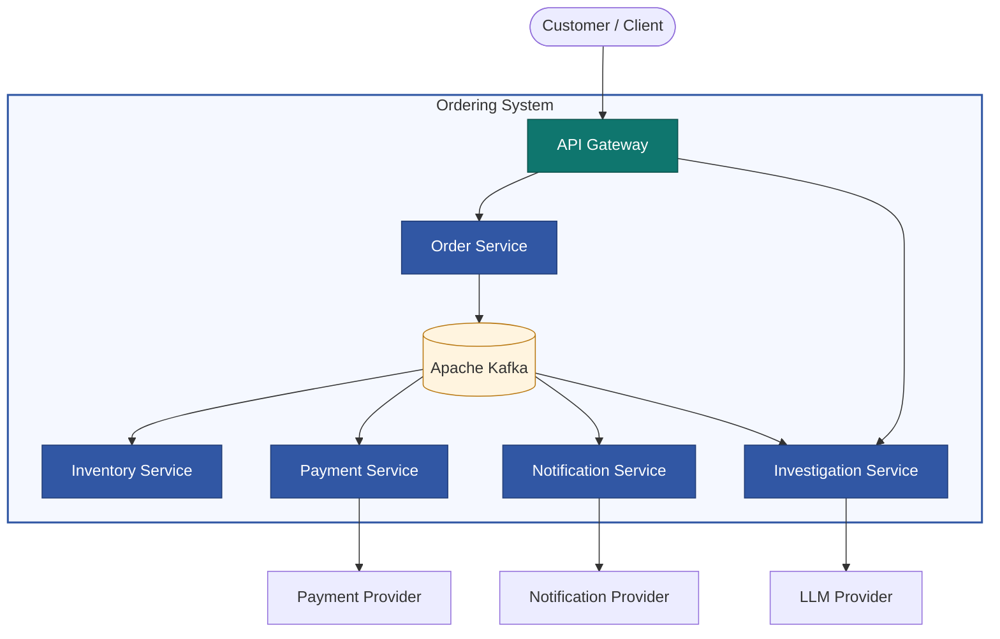

<div align="center">

# Microservices Order System

**A production-oriented architecture portfolio for reliable, observable and evolvable distributed systems.**

[](https://github.com/jusuftopic/microservices-order-system/actions/workflows/ci.yml)


[Architecture](#architecture-at-a-glance) · [Engineering focus](#engineering-focus) · [Handbook](#architecture-handbook) · [Project status](#project-status)

</div>

---

## Why this project exists

Distributed systems rarely fail cleanly. Networks become unavailable, services restart, external providers slow down, and messages may arrive more than once.

This project explores how architectural decisions, implementation patterns, automated validation and observability can work together to preserve business correctness under those conditions. The goal is not to maximize the number of services or technologies. It is to keep the system **reliable, understandable and deployable as it evolves**.

The repository focuses on questions such as:

- How should services communicate when delivery is asynchronous and failures are partial?
- How is business state owned without relying on distributed transactions?
- How can recovery behaviour be designed, tested and observed?
- How should architecture decisions and trade-offs be documented?
- How can a non-deterministic LLM dependency be integrated without becoming authoritative for business state?

## Architecture at a glance


```mermaid
flowchart TB
    Client(["Customer / Client"])

    subgraph System["Ordering System"]
        direction TB

        Gateway["API Gateway"]
        Order["Order Service"]
        Inventory["Inventory Service"]
        Payment["Payment Service"]
        Notification["Notification Service"]
        Investigation["Investigation Service"]
        Kafka[("Apache Kafka")]

        Gateway --> Order
        Gateway --> Investigation
        Order --> Kafka
        Kafka --> Inventory
        Kafka --> Payment
        Kafka --> Notification
        Kafka --> Investigation
    end

    PaymentProvider["Payment Provider"]
    NotificationProvider["Notification Provider"]
    LLMProvider["LLM Provider"]

    Client --> Gateway
    Payment --> PaymentProvider
    Notification --> NotificationProvider
    Investigation --> LLMProvider

    style System fill:#f5f8ff,stroke:#3157a4,stroke-width:2px
    style Gateway fill:#0f766e,stroke:#0b514b,color:#fff
    style Kafka fill:#fff4df,stroke:#b97811
    style Order fill:#3157a4,stroke:#213d76,color:#fff
    style Inventory fill:#3157a4,stroke:#213d76,color:#fff
    style Payment fill:#3157a4,stroke:#213d76,color:#fff
    style Notification fill:#3157a4,stroke:#213d76,color:#fff
    style Investigation fill:#3157a4,stroke:#213d76,color:#fff
```

## Engineering focus

| Concern | How the project addresses it |
|---|---|
| Reliable messaging | Transactional publication, idempotent processing and explicit failure handling |
| Distributed workflows | Orchestrated order lifecycle with compensation and recovery paths |
| Service ownership | Database per service, local transactions and explicit domain responsibility |
| Resilience | Retries, circuit breaking, graceful shutdown and dead-letter handling |
| External dependencies | Controlled provider integration with fallback behaviour and rate limiting |
| Observability | Business and technical metrics, centralized logging and operational documentation |
| Delivery | CI pipeline, containerized services and Kubernetes deployment manifests |
| AI integration | Structured and validated LLM interaction with deterministic fallback behaviour |

## System components

| Component | Responsibility |
|---|---|
| Order Service | Owns the order lifecycle and coordinates the distributed workflow |
| Inventory Service | Reserves and commits inventory |
| Payment Service | Integrates resilient payment processing |
| Notification Service | Handles customer notification delivery |
| Investigation Service | Provides validated LLM-supported order analysis with deterministic fallback |
| API Gateway | Provides the public entry point, path-based routing and request protection |

## Architecture handbook

The implementation is supported by a living handbook that explains the design, not only the code:

- [Business context](_docs/handbook/01-business-context.md)
- [Architecture overview](_docs/handbook/03-architecture-overview.md)
- [Service responsibilities](_docs/handbook/04-service-responsibilities.md)
- [Event flow](_docs/handbook/06-event-flow.md)
- [Reliable messaging](_docs/handbook/07-reliable-messaging.md)
- [Resilience and fault tolerance](_docs/handbook/08-resilience-&-fault-tolerance.md)
- [Observability](_docs/handbook/09-observability.md)
- [Deployment](_docs/handbook/11-deployment.md)
- [CI pipeline](_docs/handbook/12-pipeline.md)
- [Trade-offs](_docs/handbook/14-tradeoffs.md)
- [Failure scenarios](_docs/handbook/15-failure-scenarios.md)
- [Architecture Decision Records](_docs/handbook/16-architecture-decision-records.md)

## Repository structure

```text
.
├── order-service/
├── inventory-service/
├── payment-service/
├── notification-service/
├── investigation-service/
├── messaging-starter/
├── commons/
├── _gateway/
├── _k8s/
├── _observability/
├── _docs/
└── .github/workflows/
```

## Project status

This is an **ongoing personal engineering project** developed as a long-term architecture portfolio.

### Implemented

- Reliable event-driven workflows
- Architecture handbook and ADRs
- Kubernetes deployment manifests
- CI pipeline
- Observability foundations
- API gateway with path-based routing and rate limiting
- Validated LLM-supported investigation flow

### In progress

- AWS deployment in the separate [infrastructure repository](https://github.com/jusuftopic/microservices-order-system-infrastructure)
- Continued production hardening and failure-scenario validation

## Design principle

Every major improvement should answer a concrete architectural problem. New technology is introduced only when it makes the system more reliable, observable, secure or easier to evolve.

---

<div align="center">

Built and documented by [Jusuf Topić](https://github.com/jusuftopic) · [LinkedIn](https://www.linkedin.com/in/jusuf-topic-407789200) · [Medium](https://medium.com/@jusuftopic)

</div>
