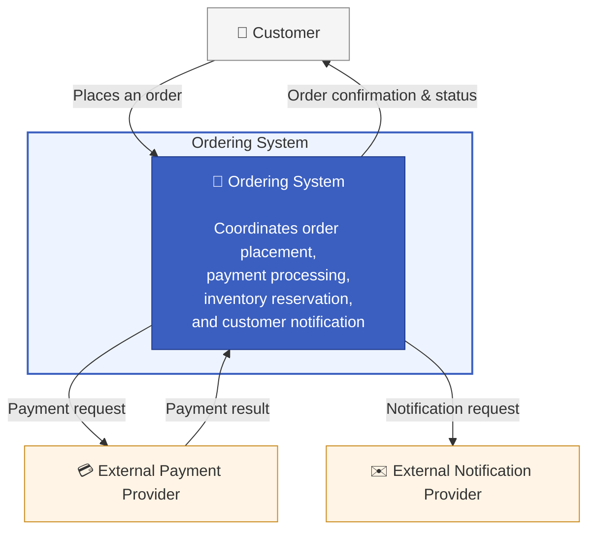

# Business Context

## Purpose

This project is a reference implementation of a production-oriented event-driven microservice architecture. The chosen domain—order processing—serves as a realistic business scenario to demonstrate architectural patterns commonly required in distributed systems.

Rather than focusing on business functionality, the project emphasizes architectural qualities such as reliability, scalability, observability, and maintainability. It illustrates how modern architectural practices can help organizations build systems that evolve safely as business requirements grow.

# Business Context Diagram

