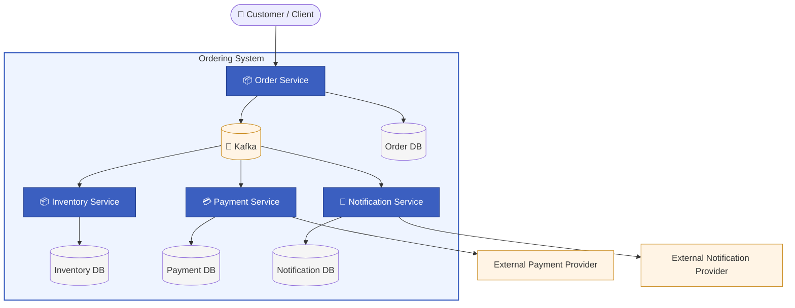

# Architecture Overview

## Purpose

This chapter provides a high-level view of the order processing system and its main architectural building blocks. It explains how the system is organized around business capabilities and how the services cooperate to process an order reliably.

The system is designed as an event-driven microservice architecture. Each service owns a specific business capability and communicates with other services through asynchronous events where reliability and decoupling are important.

## Main Components

| Component | Responsibility                                                          |
|---|-------------------------------------------------------------------------|
| Order Service | Manages the order lifecycle and coordinates the overall order workflow. |
| Inventory Service | Reserves, confirms, or releases inventory based on order progress.      |
| Payment Service | Reliably processes payment requests and reports payment outcomes.       |
| Notification Service | Sends customer-facing notifications based on order events.              |
| Kafka | Enables asynchronous communication between services.                    |
| Service Databases | Each service owns its data and persists its local state independently.  |

## High-Level Business Flow

A customer places an order through the Order Service. The Order Service records the order and starts the fulfillment workflow.

Inventory is then reserved by the Inventory Service. If inventory is available, the payment process continues. The Payment Service processes the payment and reports the result back to the system.

Based on the outcome, the order is either completed or compensated. The Notification Service is responsible for informing the customer about relevant order status changes.

## Architectural Style

The system uses microservices to separate business capabilities and event-driven communication to reduce runtime coupling between services. This allows individual services to evolve independently while still participating in a larger business process.

The architecture intentionally embraces eventual consistency. Each service owns and updates only its local data, preserving clear ownership boundaries and avoiding distributed transactions. While business capabilities are executed across multiple services, the Order Service remains the single authority responsible for managing and updating the overall order lifecycle. Progress is communicated through domain events, allowing the Order Service to transition the order through its various states based on the outcomes reported by other services.

## Scope of This Overview

This chapter intentionally avoids implementation details such as Kafka topics, Outbox tables, retry policies, Kubernetes manifests, and observability setup. These topics are explained in dedicated chapters.