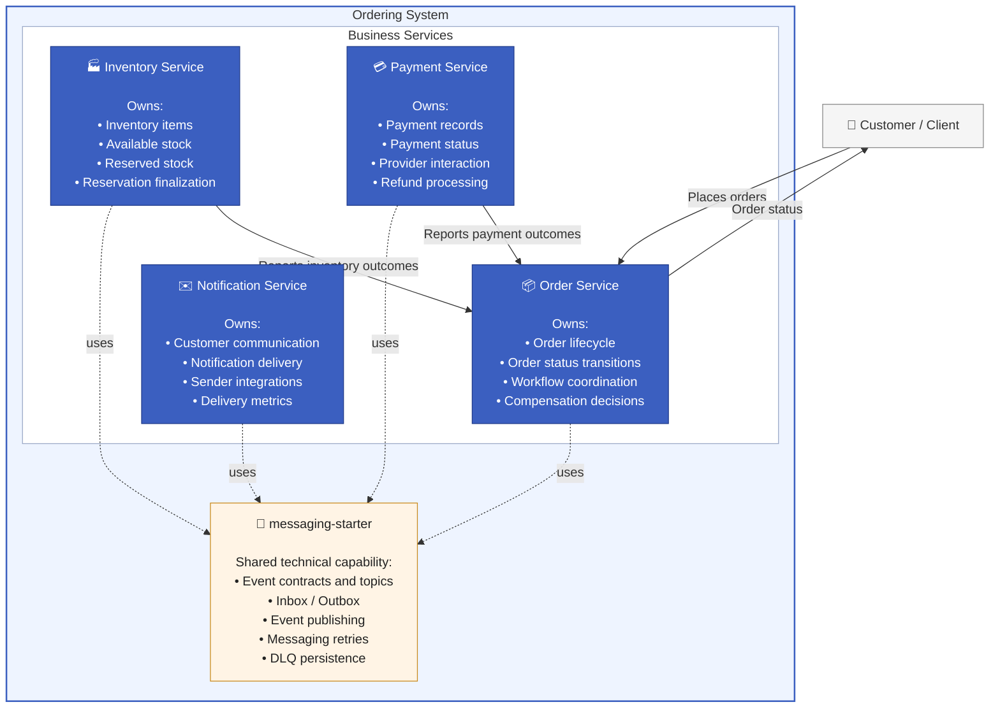

# Service Responsibilities

## Purpose

This chapter defines the responsibility boundaries of each service in the order processing system. The goal is to make clear which service owns which business capability, which data it controls, and which decisions it is allowed to make.

Clear responsibility boundaries reduce coupling, prevent shared ownership of business state, and make the system easier to evolve independently.

## Responsibility Boundaries

Each service owns its local data and business rules. No service directly modifies another service's database or internal state.

Services communicate business outcomes through events. A service may react to events from other services, but it remains responsible only for its own capability.

The Order Service is the authority for the overall order lifecycle. Other services report outcomes such as inventory reservation, payment success, payment failure, or inventory commit completion, but only the Order Service updates the order status.

## Business Services

| Service              | Primary Responsibility                     | Owns                                                                                           | Does Not Own                                              |
| -------------------- | ------------------------------------------ |------------------------------------------------------------------------------------------------| --------------------------------------------------------- |
| Order Service        | Manages the order lifecycle                | Orders, order items, order status transitions, compensation decisions, lifecycle orchestration | Inventory stock, payment execution, notification delivery |
| Inventory Service    | Manages stock reservation and finalization | Inventory items, available quantity, reserved quantity                                         | Order status, payment state                               |
| Payment Service      | Handles payment processing                 | Payment records, payment status, provider interaction result                                   | Order completion decision, inventory state                |
| Notification Service | Sends customer notifications               | Notification delivery logic                                                                    | Business workflow decisions, order status                 |

## Order Service

The Order Service is the central business authority for the order lifecycle. It receives customer order requests, creates orders, and controls how an order moves through its lifecycle.

It is responsible for:

* creating new orders
* storing order items and customer information
* generating the initial inventory reservation request
* reacting to inventory reservation results
* triggering payment requests after inventory is reserved
* reacting to payment results
* triggering inventory commit after successful payment
* triggering inventory release after failed payment
* marking orders as completed or failed
* handling timeout scenarios
* initiating compensation actions
* emitting customer notification requests
* update order status according every update

The Order Service does not reserve stock, charge payments, or send notifications directly. It coordinates the workflow by publishing commands and reacting to outcome events.

The order lifecycle is protected by explicit status transitions. This prevents invalid state changes and ensures that the order can only move through allowed business states.

## Inventory Service

The Inventory Service owns inventory-related business rules. It decides whether requested products are available and manages the difference between available and reserved stock.

It is responsible for:

* receiving inventory reservation requests
* checking whether requested products exist
* checking whether enough stock is available
* reserving inventory for an order
* committing previously reserved inventory after successful payment
* releasing reserved inventory when compensation is required
* publishing inventory success or failure outcomes

The Inventory Service does not decide whether an order is completed or failed. It only reports inventory outcomes back to the system.

This separation keeps stock management independent from the order lifecycle while still allowing the Order Service to make final workflow decisions.

## Payment Service

The Payment Service owns payment processing. It creates and updates payment records, interacts with the payment provider abstraction, and reports payment outcomes.

It is responsible for:

* receiving payment requests
* creating payment records for orders
* preventing duplicate payment processing
* moving payments through pending, processing, success, or failed states
* calling the payment provider outside the main database transaction
* storing payment success or failure events
* handling refund requests as part of compensation

The Payment Service does not decide whether the order is completed. It reports whether payment succeeded or failed, and the Order Service uses that outcome to continue the order workflow.

A key design decision is that external payment communication is separated from the database transaction. This avoids keeping database locks open during slow or unreliable provider calls.

In addition to managing payment state, the Payment Service is responsible for reliable communication with external payment providers. Since external systems may experience temporary failures or increased response times, payment requests are executed using resilient communication patterns.

The service automatically retries transient failures and temporarily suspends requests to an unavailable provider to prevent cascading failures. These mechanisms improve system stability while allowing the payment provider to recover without affecting the overall reliability of the order processing workflow.
## Notification Service

The Notification Service owns customer communication. It receives notification requests and delegates delivery to a notification sender implementation.

It is responsible for:

* receiving notification request events
* sending order-related customer notifications
* supporting different sender implementations
* recording notification metrics
* isolating notification failures from the main order workflow

The Notification Service does not make business decisions. Failed notification delivery must not change the order status or block order completion.

This makes notification delivery a supporting capability rather than a dependency that controls the core business flow.

## Shared Technical Capabilities

### `messaging-starter`

The `messaging-starter` module provides a reusable messaging foundation shared across all services. It encapsulates the technical aspects of reliable asynchronous communication while allowing each service to remain focused on its own business responsibilities.

The module includes:

- Shared event contracts and topic definitions
- Inbox and Outbox entities and repositories
- Event publishing infrastructure
- Dead Letter Queue (DLQ) persistence
- Centralized retry-related messaging infrastructure

By consolidating these capabilities into a single module, the project avoids duplicating messaging concerns across services and ensures consistent behavior for event publication, message processing, and failure handling.

The library intentionally contains **technical infrastructure only**. It does not implement business workflows or business rules. Each microservice remains fully responsible for its own domain logic, while `messaging-starter` provides the common mechanisms required for reliable event-driven communication.

## Ownership Rule

A service may publish an event about its own state or capability, but it must not directly change the state owned by another service.

For example:

* Inventory Service may publish that inventory was reserved.
* Payment Service may publish that payment succeeded.
* Notification Service may publish or record notification delivery behavior.
* Order Service decides how the order status changes based on these outcomes.

This rule keeps the architecture modular and prevents hidden coupling between services.

## Service responsibility diagram

