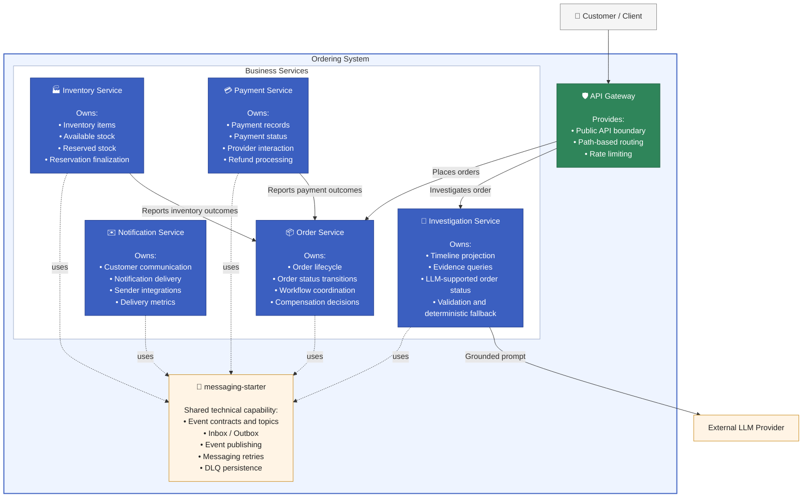

# Service Responsibilities

## Purpose

This chapter defines the responsibility boundaries of each service in the order processing system. The goal is to make clear which service owns which business capability, which data it controls, and which decisions it is allowed to make.

Clear responsibility boundaries reduce coupling, prevent shared ownership of business state, and make the system easier to evolve independently.

## Responsibility Boundaries

Each service owns its local data and business rules. No service directly modifies another service's database or internal state.

Services communicate business outcomes through events. A service may react to events from other services, but it remains responsible only for its own capability.

The Order Service is the authority for the overall order lifecycle. Other services report outcomes such as inventory reservation, payment success, payment failure, or inventory commit completion, but only the Order Service updates the order status.

## Business Services

| Service              | Primary Responsibility                     | Owns                                                                                           | Does Not Own                                              |
| -------------------- | ------------------------------------------ |------------------------------------------------------------------------------------------------| --------------------------------------------------------- |
| Order Service        | Manages the order lifecycle                | Orders, order items, order status transitions, compensation decisions, lifecycle orchestration | Inventory stock, payment execution, notification delivery |
| Inventory Service    | Manages stock reservation and finalization | Inventory items, available quantity, reserved quantity                                         | Order status, payment state                               |
| Payment Service      | Handles payment processing                 | Payment records, payment status, provider interaction result                                   | Order completion decision, inventory state                |
| Notification Service | Sends customer notifications               | Notification delivery logic                                                                    | Business workflow decisions, order status                 |
| Investigation Service | Provides validated LLM-supported order status | Its local timeline projection, generated explanations and deterministic fallback              | Authoritative order state, workflow decisions             |

## Order Service

The Order Service is the authority for the overall order lifecycle.

* creates and manages orders
* coordinates the order workflow across other services
* controls order status transitions
* decides when compensation or timeout handling is required

## Inventory Service

The Inventory Service is the authority for stock and reservations.

* manages available and reserved inventory
* reserves stock for an order
* commits or releases reservations
* reports inventory outcomes without deciding the order status

## Payment Service

The Payment Service is the authority for payment processing and payment state.

* manages payment records and their lifecycle
* integrates with external payment providers
* handles payment and refund requests reliably
* reports payment outcomes without deciding the order status

## Notification Service

The Notification Service owns customer communication related to order processing.

* receives requests for order-related notifications
* delivers notifications through the configured communication channel
* tracks notification outcomes
* remains independent from order lifecycle decisions

## Investigation Service

The Investigation Service provides an explanatory view of the distributed order workflow.

* builds a local timeline from authoritative lifecycle evidence
* provides human-readable explanations of an order's current state
* validates AI-supported explanations and provides a deterministic fallback
* remains outside the critical order-processing path and never changes order state

## Shared Technical Capabilities

### API Gateway

The API Gateway is the external boundary for application APIs. It provides:

- one stable public entry point
- path-based routing to Order and Investigation services
- rate limiting for both APIs
- stricter traffic and concurrency limits for the LLM-supported investigation path
- isolation of internal service endpoints from direct external access

The gateway does not contain workflow or domain logic. Request validation,
authorization decisions and validation of LLM-supported responses remain with
the service that owns the capability.

### `messaging-starter`

The `messaging-starter` module provides a reusable messaging foundation shared across all services. It encapsulates the technical aspects of reliable asynchronous communication while allowing each service to remain focused on its own business responsibilities.

The module includes:

- Shared event contracts and topic definitions
- Shared lifecycle contract vocabulary
- Inbox and Outbox entities and repositories
- Event publishing infrastructure
- Dead Letter Queue (DLQ) persistence
- Centralized retry-related messaging infrastructure

By consolidating these capabilities into a single module, the project avoids duplicating messaging concerns across services and ensures consistent behavior for event publication, message processing, and failure handling.

The library intentionally contains **technical infrastructure only**. It does not implement business workflows or business rules. Each microservice remains fully responsible for its own domain logic, while `messaging-starter` provides the common mechanisms required for reliable event-driven communication.

## Ownership Rule

A service may publish an event about its own state or capability, but it must not directly change the state owned by another service.

For example:

* Inventory Service may publish that inventory was reserved.
* Payment Service may publish that payment succeeded.
* Notification Service may publish or record notification delivery behavior.
* Order Service decides how the order status changes based on these outcomes.

This rule keeps the architecture modular and prevents hidden coupling between services.

## Service responsibility diagram

```mermaid
flowchart TB
    Customer["👤 Customer / Client"]

    subgraph System["Ordering System"]
        direction TB

        ApiGateway["🛡️ API Gateway

Provides:
• Public API boundary
• Path-based routing
• Rate limiting"]

        subgraph BusinessServices["Business Services"]
            direction LR

            OrderService["📦 Order Service

Owns:
• Order lifecycle
• Order status transitions
• Workflow coordination
• Compensation decisions"]

            InventoryService["🏭 Inventory Service

Owns:
• Inventory items
• Available stock
• Reserved stock
• Reservation finalization"]

            PaymentService["💳 Payment Service

Owns:
• Payment records
• Payment status
• Provider interaction
• Refund processing"]

            NotificationService["✉️ Notification Service

Owns:
• Customer communication
• Notification delivery
• Sender integrations
• Delivery metrics"]

            InvestigationService["🔎 Investigation Service

Owns:
• Timeline projection
• Evidence queries
• LLM-supported order status
• Validation and deterministic fallback"]
        end

        MessagingStarter["📨 messaging-starter

Shared technical capability:
• Event contracts and topics
• Inbox / Outbox
• Event publishing
• Messaging retries
• DLQ persistence"]

        OrderService -. "uses" .-> MessagingStarter
        InventoryService -. "uses" .-> MessagingStarter
        PaymentService -. "uses" .-> MessagingStarter
        NotificationService -. "uses" .-> MessagingStarter
        InvestigationService -. "uses" .-> MessagingStarter
    end

    LlmProvider["External LLM Provider"]

    Customer --> ApiGateway
    ApiGateway -->|"Places orders"| OrderService
    ApiGateway -->|"Investigates order"| InvestigationService
    InvestigationService -->|"Grounded prompt"| LlmProvider

    InventoryService -->|"Reports inventory outcomes"| OrderService
    PaymentService -->|"Reports payment outcomes"| OrderService

    style System fill:#eef4ff,stroke:#3b5fc0,stroke-width:2px
    style BusinessServices fill:#ffffff,stroke:#9aa8c7,stroke-width:1px

    style OrderService fill:#3b5fc0,stroke:#1f3a8a,color:#ffffff
    style InventoryService fill:#3b5fc0,stroke:#1f3a8a,color:#ffffff
    style PaymentService fill:#3b5fc0,stroke:#1f3a8a,color:#ffffff
    style NotificationService fill:#3b5fc0,stroke:#1f3a8a,color:#ffffff
    style InvestigationService fill:#3b5fc0,stroke:#1f3a8a,color:#ffffff
    style ApiGateway fill:#2f855a,stroke:#1f5f40,color:#ffffff

    style MessagingStarter fill:#fff4e5,stroke:#c98a1c,color:#222222

    style Customer fill:#f5f5f5,stroke:#888888
    style LlmProvider fill:#fff4e5,stroke:#c98a1c,color:#222222
```
