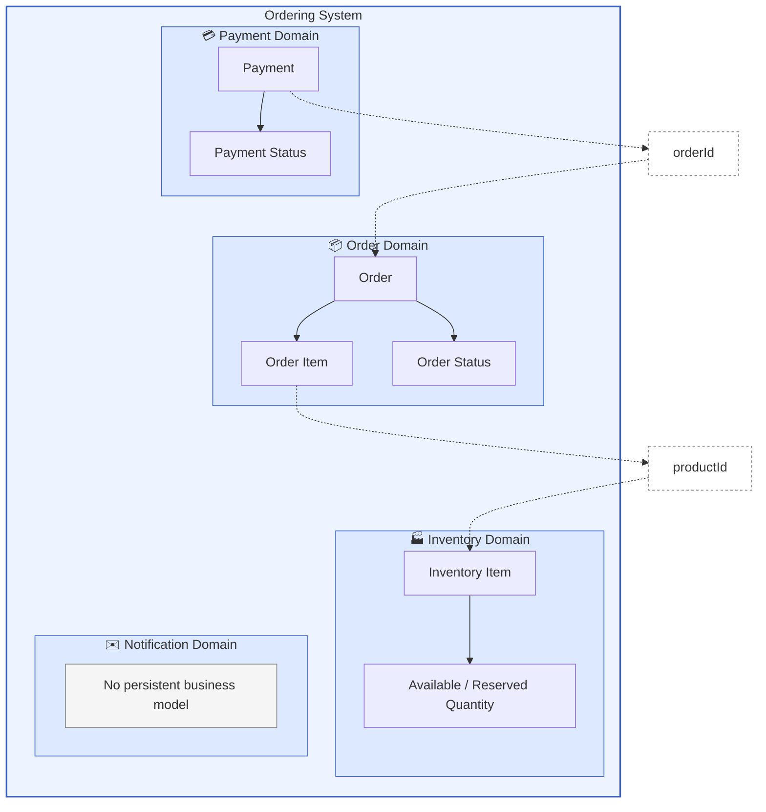

# Domain Model

## Purpose

This chapter describes the core business concepts of the order processing system, their ownership boundaries, and the rules that govern how they change.

The domain model is intentionally distributed across service boundaries. Each service owns the model required for its business capability and exposes outcomes through events rather than sharing entities or database tables.

## Domain Boundaries

The system is divided into four business domains:

| Domain       | Core Responsibility                           | Primary Model                              |
| ------------ | --------------------------------------------- | ------------------------------------------ |
| Order        | Controls the overall order lifecycle          | Order, Order Item, Order Status            |
| Inventory    | Manages product availability and reservations | Inventory Item                             |
| Payment      | Manages payment attempts and payment outcomes | Payment, Payment Status                    |
| Notification | Delivers customer-facing messages             | Notification request and delivery behavior |

The Order, Inventory, and Payment domains maintain their own persistent business state. The Notification domain is treated as a supporting capability and is therefore implemented as a choreographed part of the saga rather than being orchestrated like the other domains. As a result, it does not report status back to the Order Service and does not participate in controlling the order workflow.

## Order Domain

The Order domain represents the customer purchase and the business process required to complete it.

### Order

An `Order` is the central aggregate of the Order Service. It contains:

* a unique order identifier
* the current order status
* customer contact information
* one or more order items
* a correlation identifier used across the distributed workflow
* creation and update timestamps

The Order Service is the only service allowed to change the order status.

Other services may report business outcomes, but they do not directly modify the order or decide its final state.

### Order Item

An `Order Item` represents a requested product and quantity within an order.

It contains:

* a product identifier
* the requested quantity
* a reference to its owning order

The product identifier is an external business reference. The Order Service does not own product inventory or availability.

### Order Lifecycle

The order progresses through explicit lifecycle states:

* `CREATED`
* `INVENTORY_RESERVE_COMPLETED`
* `INVENTORY_RESERVE_FAILED`
* `PAYMENT_COMPLETED`
* `PAYMENT_FAILED`
* `INVENTORY_COMMIT_COMPLETED`
* `INVENTORY_COMMIT_FAILED`
* `COMPLETED`
* `FAILED`
* `TIMED_OUT`

Transitions are validated centrally by the Order Service. An order cannot move directly between arbitrary states.

To make these constraints easier to understand, the following diagram illustrates the valid state transitions for an order:

```
CREATED
  |
  v
INVENTORY_RESERVE_COMPLETED -----> INVENTORY_RESERVE_FAILED
  |                                      |
  v                                      v
PAYMENT_COMPLETED ---------------> PAYMENT_FAILED
  |                                      |
  v                                      v
INVENTORY_COMMIT_COMPLETED -----> INVENTORY_COMMIT_FAILED
  |                                      |
  v                                      v
COMPLETED                               FAILED

Any non-final state may also transition to:
  -> TIMED_OUT
```

This diagram highlights the linear progression of a successful order, as well as the failure paths at each stage.

For example:

* a newly created order may proceed to successful or failed inventory reservation
* payment may only be processed after inventory reservation succeeds
* inventory may only be committed after payment succeeds
* an order may only be completed after inventory commit succeeds

Final states are:

* `COMPLETED`
* `FAILED`
* `TIMED_OUT`

Once an order reaches a final state, further lifecycle updates are rejected or ignored. The Order Service also periodically scans for orders that remain in a non-final state beyond an acceptable duration and transitions them to the `TIMED_OUT` state.

## Inventory Domain

The Inventory domain owns the stock state for each product.

### Inventory Item

An `Inventory Item` is identified by its product identifier and contains:

* available quantity
* reserved quantity

The Inventory Service is the source of truth for whether stock is available.

### Inventory Invariants

A reservation may only succeed when the available quantity is greater than or equal to the requested quantity.

When inventory is reserved:

* available quantity decreases
* reserved quantity increases

When a reservation is released:

* reserved quantity decreases
* available quantity increases

These changes are performed locally by the Inventory Service. The Order Service receives only the resulting business outcome.

### Reservation and Finalization

Inventory processing is divided into distinct stages:

1. **Reservation**
   Stock is temporarily allocated to an order.

2. **Commit**
   Reserved stock is finalized after payment succeeds.

3. **Release**
   Reserved stock is returned when the order cannot be completed.

This distinction supports compensation and prevents stock from being permanently deducted before payment has completed.

## Payment Domain

The Payment domain represents the payment attempt associated with an order.

### Payment

A `Payment` contains:

* a unique payment identifier
* the related order identifier
* the current payment status
* payment provider information
* an external transaction identifier
* a correlation identifier
* an optional failure reason
* a creation timestamp

The relationship to the order is represented by an identifier rather than a shared entity relationship.

Each order may have one payment record, which helps prevent duplicate payment creation.

### Payment Lifecycle

A payment progresses through the following states:

* `PENDING`
* `PROCESSING`
* `SUCCESS`
* `FAILED`

A newly created payment starts in `PENDING`.

Before contacting the external payment provider, it moves to `PROCESSING`. Once the provider responds, it transitions to either `SUCCESS` or `FAILED`.

A successful payment stores the external transaction identifier. A failed payment stores the failure reason.

### Payment Invariants

The Payment Service prevents duplicate processing by checking the existing payment state.

For example:

* a successful payment is not processed again
* a payment already in progress is not started again
* the order identifier is unique within the payment model

These rules reduce the risk of charging the same order multiple times.

## Notification Domain

The Notification domain is responsible for customer communication triggered by order-related events.

It does not own the order lifecycle or make decisions about whether an order succeeds or fails.

Its current responsibilities include:

* receiving notification requests
* selecting a sender implementation
* delivering messages through the configured channel
* recording delivery-related metrics

Notification delivery is intentionally separated from the core order workflow. A notification failure must not invalidate an otherwise successfully completed order.

## Cross-Domain References

Services do not share persistent entities.

Cross-domain relationships are represented through identifiers such as:

* `orderId`
* `productId`
* `paymentId`
* `correlationId`
* `messageId`

The `correlationId` is shared across the entire order lifecycle and is used for tracking, logging, and enabling distributed tracing if implemented in the future.

The `messageId` is used to support inbox processing patterns, allowing services to determine whether a message has already been processed and avoid duplicate handling.

This avoids database-level coupling between services.

For example:

* the Payment Service stores an `orderId`, but it does not store or load the Order entity
* the Inventory Service processes product identifiers and quantities, but it does not access order tables
* the Order Service stores product identifiers, but it does not own inventory quantities

## Domain Communication

Domains communicate through business events and commands.

Examples include:

* inventory reservation requested
* inventory reserved
* inventory reservation failed
* payment requested
* payment completed
* payment failed
* inventory commit requested
* inventory commit completed
* inventory release requested
* notification requested

These contracts carry only the data needed by the receiving domain. Internal entities are not serialized and shared directly.

## Domain Ownership Rule

A domain may report the outcome of its own work, but it must not update state owned by another domain.

Therefore:

* Inventory Service owns stock state
* Payment Service owns payment state
* Notification Service owns delivery behavior
* Order Service owns the order lifecycle and final business outcome

This separation is the foundation for independent evolution and reliable distributed processing.

