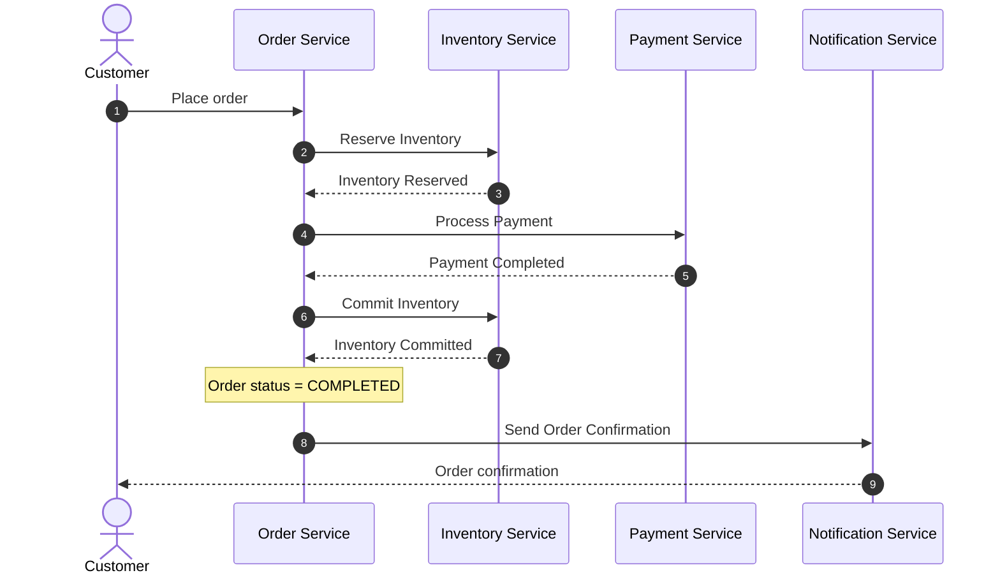
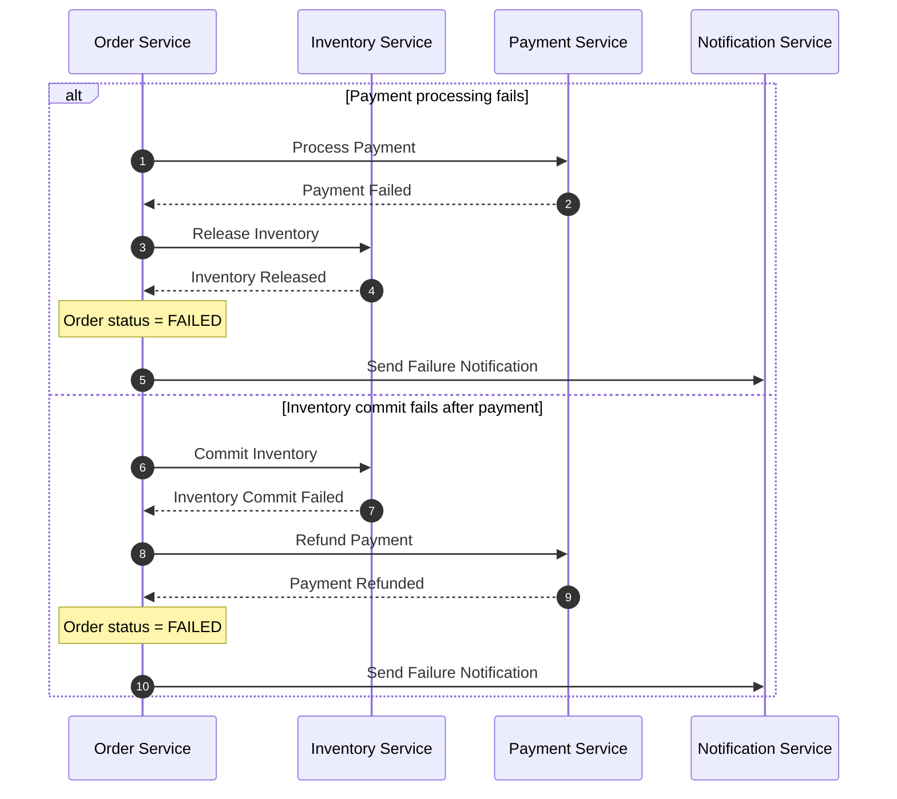

# Event Flow

## Purpose

This chapter describes how the business workflow is executed across multiple autonomous services. Rather than relying on distributed transactions, the system coordinates the order lifecycle through commands and domain events.

Each service performs its own business operation, persists its local state, and reports the outcome back to the Order Service. The Order Service then decides how the order should progress.

The result is a reliable, loosely coupled workflow in which each service remains responsible only for its own business capability.

## Command and Event Model

The communication model distinguishes between **commands** and **events**.

A **command** expresses intent. It requests another service to perform a business operation.

An **event** represents a business fact. It communicates that something has already happened and cannot be changed.

This distinction keeps responsibilities clear. Services never instruct another service how to update its internal state. Instead, they request work through commands and react to completed work through events.

### Typical Commands

| Command          | Purpose                                           |
| ---------------- | ------------------------------------------------- |
| ReserveInventory | Request reservation of ordered products           |
| ProcessPayment   | Request payment processing                        |
| CommitInventory  | Finalize previously reserved inventory            |
| ReleaseInventory | Return reserved inventory after compensation      |
| SendNotification | Notify the customer about the final order outcome |

### Typical Events

| Event                      | Meaning                                          |
| -------------------------- | ------------------------------------------------ |
| InventoryReserved          | Inventory reservation completed successfully     |
| InventoryReservationFailed | Inventory could not be reserved                  |
| PaymentCompleted           | Payment completed successfully                   |
| PaymentFailed              | Payment processing failed                        |
| InventoryCommitted         | Reserved inventory has been permanently deducted |
| InventoryReleased          | Reserved inventory has been returned             |

## Happy Path

A successful order follows the sequence below:

1. The customer places an order.
2. The Order Service creates the order and publishes a `ReserveInventory` command.
3. The Inventory Service reserves the requested products and publishes an `InventoryReserved` event.
4. The Order Service updates the order status and publishes a `ProcessPayment` command.
5. The Payment Service processes the payment and publishes a `PaymentCompleted` event.
6. The Order Service updates the order status and publishes a `CommitInventory` command.
7. The Inventory Service permanently deducts the reserved inventory and publishes an `InventoryCommitted` event.
8. The Order Service marks the order as completed.
9. A notification request is published for the Notification Service.

At every step, the participating service modifies only its own data. The Order Service remains the single authority responsible for the overall order lifecycle.

## Failure and Compensation

Failures are handled locally whenever possible.

If inventory cannot be reserved, the workflow terminates immediately and the order is marked as failed.

If payment processing fails after inventory has already been reserved, the Order Service initiates compensation by publishing a `ReleaseInventory` command. Once the Inventory Service confirms that the reservation has been released, the order transitions to the `FAILED` state.

If inventory cannot be committed after a successful payment, the workflow initiates compensation by requesting a payment refund. After the refund is completed, the order is marked as failed.

The workflow also protects against indefinitely running business processes. Orders that remain in an intermediate state beyond an acceptable timeout are automatically transitioned to the `TIMED_OUT` state.

## Preserving Service Ownership

Although the workflow spans multiple services, ownership boundaries remain intact throughout the entire process.

This architectural principle allows services to evolve independently while still participating in a larger distributed business process.

**Sequence Diagram:** Happy Path

**Diagram:** Compensation Flow

