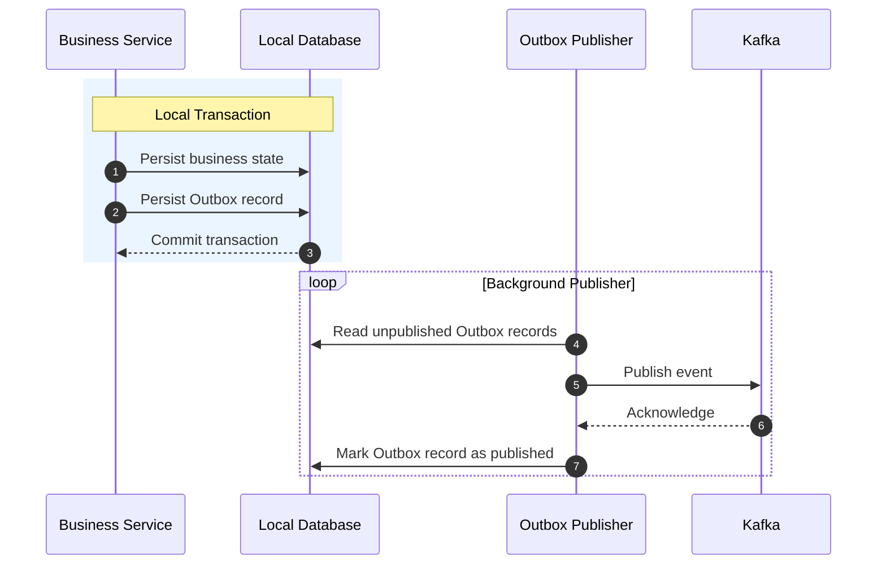
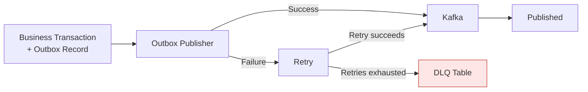
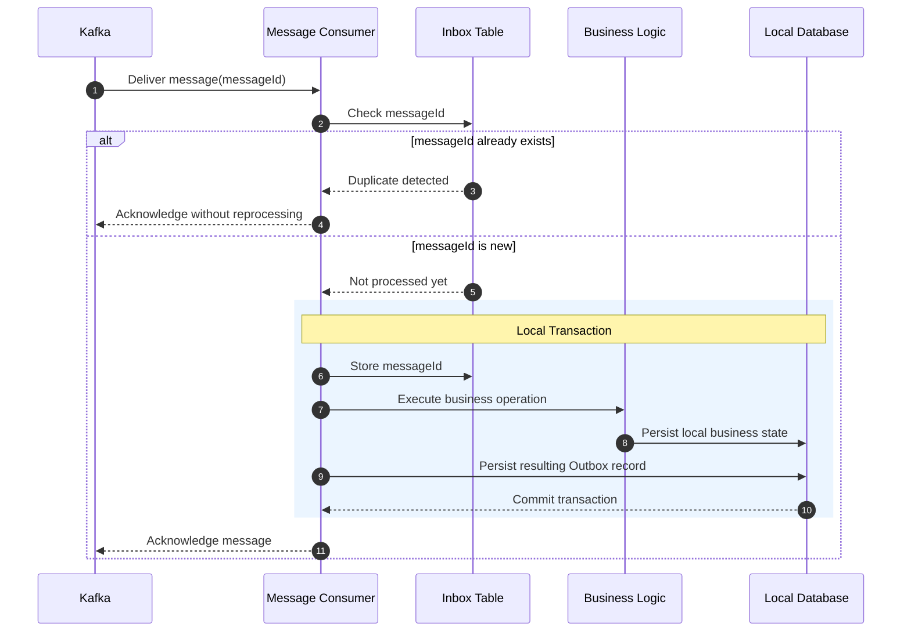
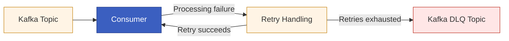

# Reliable Messaging: Inbox and Outbox

## Purpose

This chapter explains how the system publishes and consumes messages reliably without relying on distributed transactions.

The architecture combines the Outbox pattern, the Inbox pattern, publication retries, consumer retries, and two different dead-letter mechanisms. Together, they protect the workflow from lost messages, duplicate processing, poison messages, and temporary infrastructure failures.

## The Dual-Write Problem

A service frequently needs to perform two operations:

1. update its local business state
2. publish a message to Kafka

Performing these operations independently creates a dual-write risk.

For example:

* the database transaction may succeed while Kafka publication fails
* Kafka publication may succeed while the database transaction is rolled back

Either case can leave the distributed workflow inconsistent.

The Outbox pattern removes this risk by storing the business update and the outgoing message in the same local database transaction.

## Outbox Pattern

When a service performs a business operation, it does not publish directly to Kafka inside the business transaction.

Instead, it stores:

* the updated business state
* an Outbox record representing the message to be published

Both changes are committed atomically in the same local transaction.

A separate Outbox publisher later reads pending records and attempts to publish them to Kafka.

The general flow is:

1. execute the business operation
2. update local business state
3. create an Outbox record
4. commit both changes in one transaction
5. publish the message asynchronously
6. mark the Outbox record as successfully published

This guarantees that an outgoing message is not lost after the related business transaction has committed, and also prevents the opposite scenario where a message is sent but the local business state fails to persist.

## Inbox Pattern

Kafka provides at-least-once delivery, which means that a consumer may receive the same message more than once.

The Inbox pattern protects business operations from duplicate execution.

Each incoming message contains a unique `messageId`. Before performing business processing, the consumer checks whether that identifier has already been recorded in its Inbox table.

If the `messageId` already exists, the message has previously been processed and the duplicate delivery is ignored.

If it does not exist, the service:

1. records the `messageId`
2. performs its local business operation
3. stores any resulting Outbox message
4. commits the work in a local transaction

The `messageId` therefore acts as the deduplication key for incoming messages.

## Delivery Semantics

The system does not attempt to provide global exactly-once delivery.

Instead, it combines:

* at-least-once message delivery
* Inbox-based deduplication
* idempotent business processing
* transactional Outbox persistence

This provides effectively-once business processing at the service boundary, provided that the Inbox record and business changes are committed atomically.

## Publication Retry

The Outbox publisher retries messages that cannot be published successfully.

Temporary failures may include:

* Kafka broker unavailability
* network interruption
* publication timeout
* temporary serialization or infrastructure problems

The failed Outbox record remains available for additional publication attempts rather than being discarded.

After the configured retry policy is exhausted, the record can be moved to the database Dead Letter Queue table.

## DLQ Table

The DLQ table belongs to the service database and protects the publication side of the messaging flow.

It contains messages that could not be published successfully from the Outbox after the permitted attempts.

Typical causes may include:

* invalid or non-serializable message payloads
* permanently malformed Outbox data
* repeated publication failures
* unsupported message structures
* errors that would otherwise cause the publisher to retry indefinitely

The purpose of the DLQ table is to isolate poison Outbox records before they repeatedly block or disrupt publication, ensuring that these messages are not simply lost but instead require special intervention for investigation, correction, or manual replay.

It preserves the original message and failure information for:

* investigation
* correction
* manual replay
* operational auditing

A message in the DLQ table has not necessarily reached Kafka.

## Kafka Dead-Letter Topic

The Kafka dead-letter topic protects the consumer side of the messaging flow.

It is used when a message already exists in Kafka but a consumer cannot process it successfully.

For the Order, Inventory, and Payment services, the Kafka listener error handling provides:

* centralized consumer retry handling
* fixed retry intervals
* routing of exhausted messages to a dedicated dead-letter topic
* preservation of the original Kafka partition where appropriate

A failed message is retried three times with a two-second delay between attempts.

If processing still fails, the message is published to the service's configured dead-letter topic. This prevents a poison message from blocking further consumption from the partition. Dead-letter topics are defined per service rather than per individual topic, which provides a balanced trade-off between operational reliability and simplicity, while also reducing infrastructure complexity and cost for a smaller, side-project-scale system.

Some failures are treated as non-retryable, including:

* deserialization failures
* invalid message arguments

These failures are routed to the dead-letter topic without repeatedly executing business processing that cannot succeed.

The configured `ErrorHandlingDeserializer` ensures that deserialization failures can be captured by the listener error-handling infrastructure rather than terminating consumption without controlled recovery.

## DLQ Table vs. DLQ Topic

The two dead-letter mechanisms solve different problems.

| Mechanism | Failure Boundary   | Message Reached Kafka? | Primary Purpose                           |
| --------- | ------------------ | ---------------------- | ----------------------------------------- |
| DLQ table | Outbox publication | Not necessarily        | Isolate messages that cannot be published |
| DLQ topic | Kafka consumption  | Yes                    | Isolate messages that cannot be consumed  |

Together, they create two layers of protection:

1. **Before Kafka:** the DLQ table protects the Outbox publisher.
2. **After Kafka:** the DLQ topic protects Kafka consumers.

This distinction prevents publication failures and consumption failures from being treated as the same operational problem, while also ensuring that no message is lost at any stage of the process, even in invalid or failure scenarios.

## Shared Messaging Infrastructure

The `messaging-starter` module centralizes the reusable infrastructure required by these patterns.

It provides shared support for:

* Inbox entities and repositories
* Outbox entities and repositories
* Outbox publication
* publication retries
* DLQ table persistence
* shared event contracts
* topic definitions
* message identifiers

Business services remain responsible for deciding:

* which event should be produced
* when an event should be produced
* how an incoming message affects local business state

The shared library provides reliability mechanisms but does not own business decisions.

## Failure Layers

The complete messaging path contains several defensive layers:

1. Business state and Outbox message are committed atomically.
2. Failed Outbox publication is retried.
3. Permanently unpublishable records are moved to the DLQ table.
4. Kafka may redeliver successfully published messages.
5. Inbox deduplication prevents repeated business processing.
6. Consumer failures are retried.
7. Permanently unprocessable Kafka records are routed to the DLQ topic.

These layers allow the system to tolerate failures at different stages without losing the message or silently corrupting business state.

## Diagram Placeholders

**Diagram:** Transactional Outbox Pattern

**Diagram:** Transactional Outbox Pattern (incl. retry strategy)

**Diagram:** Transactional Inbox Pattern

**Diagram:** Transactional Inbox Pattern (incl. retry strategy)
