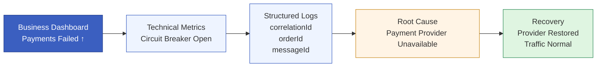
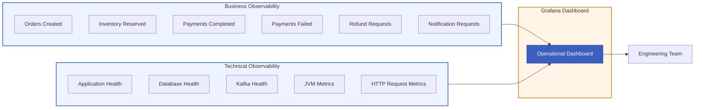

# Observability

## Purpose

Building a distributed system is only part of the challenge. Operating it reliably requires understanding how business workflows behave while the system is running.

Unlike a monolithic application, a single customer request in this architecture travels across multiple independent services, asynchronous messaging, databases, and external providers. When a failure occurs, the root cause is often separated from its visible symptom.

For this reason, the architecture treats observability as a first-class capability rather than an operational afterthought.

The goal is not simply to monitor whether services are running, but to provide sufficient visibility to answer three fundamental questions:

* Is the system healthy?
* Is the business workflow progressing correctly?
* If something fails, where did it fail and why?

## Observability Strategy

The project combines multiple complementary forms of observability:

* business metrics that describe the health of the order processing workflow
* technical metrics that monitor application and infrastructure behaviour
* structured logging for diagnosing failures
* centralized dashboards that provide a real-time operational view

Together, these capabilities allow engineering teams to detect problems quickly, understand their impact, and identify the underlying cause with minimal investigation.

## Business Observability

The most valuable metrics are those that describe the business itself.

Infrastructure metrics may indicate that an application is healthy, but they cannot answer whether customer orders are actually being processed successfully.

For this reason, the system exposes business metrics that reflect the major stages of the ordering workflow.

Examples include:

* orders created
* inventory reservations
* successful payments
* failed payments
* refund requests
* notification requests

These metrics provide immediate visibility into the health of the business process rather than only the health of the underlying infrastructure.

For example:

* an increase in payment failures may indicate an unavailable payment provider
* an unexpected rise in refund requests may reveal failures during compensation
* a growing difference between created orders and completed payments may indicate that orders are becoming stuck within the workflow

Business metrics therefore allow operational teams to detect customer-impacting issues before users begin reporting them.

## Technical Observability

Business metrics explain what is happening.

Technical metrics explain why.

The system continuously exposes operational metrics covering both application behaviour and infrastructure dependencies.

Examples include:

* application health
* database connectivity
* Kafka connectivity
* JVM resource utilisation
* HTTP request behaviour
* retry activity
* messaging throughput

These measurements provide the operational context required to understand degraded system behaviour and infrastructure failures.

## Structured Logging

Metrics indicate that a problem exists.

Logs explain the sequence of events that produced it.

Each service records meaningful business operations together with contextual identifiers that simplify investigation across multiple services.

Examples include:

* order identifiers
* message identifiers
* correlation identifiers
* retry attempts
* external provider failures
* compensation actions

Rather than producing isolated technical messages, logs are designed to connect technical events to the corresponding business workflow.

This significantly reduces the time required to diagnose production incidents.

To illustrate how structured logging enables traceability across services, consider the following example of a single order flowing through multiple services. Each log entry includes consistent identifiers such as the order ID and correlation ID, allowing the entire workflow to be reconstructed:
- [ORDER-SERVICE] Order 123 successfully created. Status: CREATED. Correlation ID abc-xyz-001
- [INVENTORY-SERVICE] Processing inventory for order 123. Correlation ID abc-xyz-001
- [PAYMENT-SERVICE] Payment 123 for order 123 set in processing state. Correlation ID abc-xyz-001

In this sequence, the same order identifier appears across all services, while the correlation ID (when propagated) links the entire transaction. This structure allows operators to follow the lifecycle of a request across service boundaries, making it significantly easier to diagnose issues in distributed workflows.

## Operational Dashboard

Operational data becomes most valuable when presented in a centralized view.

The project includes a Grafana dashboard that aggregates business metrics collected from all services through Prometheus.

Instead of displaying only infrastructure statistics, the dashboard provides a business-oriented overview of the ordering process.

Operators can immediately observe metrics such as:

* total orders created over time
* successful versus failed payments
* refund requests triggered by compensation flows
* notification requests sent to customers

This allows teams to identify abnormal business behavior without inspecting individual service logs.

The dashboard therefore serves as the primary operational entry point for monitoring the health of the distributed workflow.

## From Detection to Diagnosis

Observability supports a structured investigation process.

Business metrics identify that abnormal behavior exists.

Technical metrics narrow the affected subsystem.

Structured logs then provide the detailed execution history required to identify the underlying cause.

This layered approach reduces the time required to detect, diagnose, and resolve production incidents while minimizing the impact on business operations.

##  Future Enhancements: Distributed Tracing

While the current observability approach provides strong visibility through metrics and logs, one planned enhancement is the integration of distributed tracing.

Distributed tracing will allow the system to follow a single request as it propagates across multiple services, capturing the full execution path and timing of each step.

This adds a layer of insight beyond logs and metrics by visualizing how services interact in real time.

The primary benefit of this capability is the ability to quickly identify which specific service is responsible for a failure or performance degradation. 

Instead of manually correlating logs across services, operators will be able to see the exact point where a request slowed down or failed.

This will further reduce investigation time and improve the ability to diagnose complex issues in distributed workflows.

**Diagram:** Incident Investigation Flow

**Diagram:** Business and Technical Observability -> Complete Operational View
