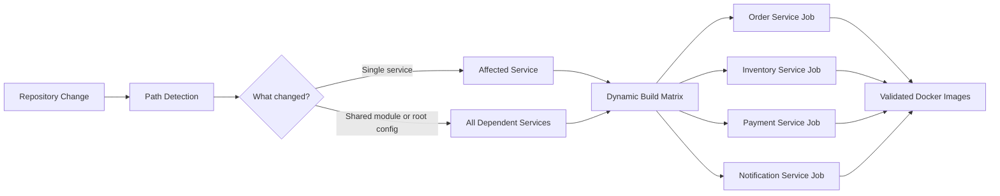
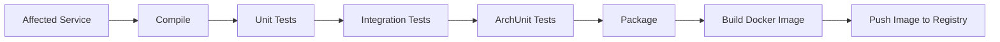

# Continuous Integration Pipeline

## Purpose

Developing a distributed system introduces multiple independently deployable services, shared libraries, and several layers of automated testing. As the project evolves, manually validating every change quickly becomes impractical and increases the risk of introducing regressions.

The Continuous Integration (CI) pipeline automates this validation process by ensuring that every relevant change is compiled, tested, packaged, and verified before it can be considered ready for deployment.

Rather than serving only as a build automation tool, the pipeline acts as a continuous quality gate that protects both the implementation and the architecture of the system.

## Pipeline Strategy

The project is maintained as a monorepository containing multiple independent microservices together with shared modules.

Building every service after every change would provide maximum confidence but would also significantly increase build times and reduce developer productivity.

Instead, the pipeline follows a selective validation strategy. It first determines which services are affected by a change and validates only those components together with their required dependencies.

Changes to shared modules, such as the `messaging-starter`, automatically trigger validation of every dependent service, ensuring that shared infrastructure modifications cannot introduce unnoticed regressions.

This approach provides fast feedback while maintaining confidence that affected services remain fully functional.

## Dynamic Build Matrix

After detecting the affected services, the pipeline dynamically generates a build matrix.

Each affected service is built independently, allowing validation tasks to execute in parallel.

This approach provides several benefits:

* independent validation of each service
* reduced overall pipeline execution time
* efficient utilisation of build resources
* simplified scalability as additional services are introduced

By building only the services impacted by a change, the pipeline preserves the deployment independence expected from a microservice architecture while avoiding unnecessary work.

## Automated Quality Gates

The CI pipeline acts as an automated quality gate that verifies every affected service before a Docker image is produced.

Validation is performed through multiple complementary testing layers:

* **Unit tests** verify individual components in isolation.
* **Integration tests** validate interactions between application components and external infrastructure.
* **Architecture tests** continuously verify that the intended architectural rules remain satisfied.

Unlike functional tests, architecture tests protect the long-term structure of the system. Using ArchUnit, architectural constraints become executable rules that are automatically verified during every pipeline execution.

This prevents gradual architectural erosion by ensuring that new changes continue to respect the established layering, dependency boundaries, and design principles defined for the system.

Only after all validation stages complete successfully is the service packaged and its Docker image created.

## Containerization

Each successfully validated service is packaged as an independent Docker image.

Producing container images as part of the CI pipeline ensures that every successfully built artifact is deployment-ready and can be executed consistently across different environments.

This establishes a reproducible deployment artifact while ensuring that validated images are pushed to an external repository for further processing in subsequent stages of the delivery pipeline.

## Diagrams

**Selective Monorepo Pipeline**

**Automated Quality Gates**
